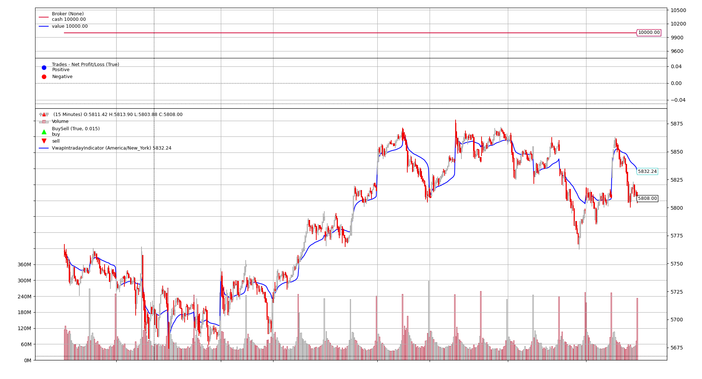
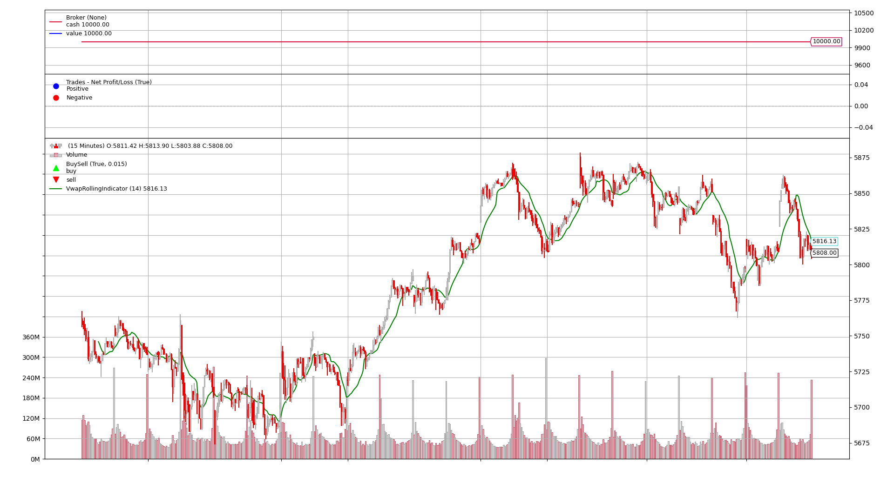

# Volume Weighted Average Price (VWAP) Indicators for Backtrader

This project demonstrates the use of Volume Weighted Average Price (VWAP) indicators in trading strategies, implemented using the Backtrader framework. It allows users to visualize VWAP indicators across different timeframes.

---

## Table of Contents

- [About the Indicators](#about-the-indicators)
- [Indicator Code and Explanation](#indicator-code-and-explanation)
- [Installation and Setup](#installation-and-setup)
- [Running the Project](#running-the-project)

---

## About the Indicators

### Volume Weighted Average Price (VWAP)

VWAP is an indicator that calculates the average price of an asset over a specified period, weighted by volume. It is frequently used to gauge the typical trading price, taking both price and volume into account. 

This project includes two VWAP indicators:
1. **VWAP Intraday Indicator**: Resets at the start of each trading day.
2. **VWAP Rolling Indicator**: Uses a rolling window (e.g., 14 bars) for continuous VWAP calculation.

---

## Indicator Code and Explanation

### VWAP Intraday Indicator

Calculates daily VWAP based on the high, low, and close price averages, adjusting at the start of each new day.



```python

class VwapIntradayIndicator(bt.Indicator):
    """
    Volume Weighted Average Price (VWAP) indicator for intraday trading.
    """

    lines = ("vwap_intraday",)
    params = {"timezone": "America/New_York"}
    plotinfo = {"subplot": False}
    plotlines = {"vwap_intraday": {"color": "blue"}}

    def __init__(self) -> None:
        self.hlc = (self.data.high + self.data.low + self.data.close) / 3.0

        self.current_date: Optional[datetime.date] = None
        self.previous_date_index: int = -1

    def next(self) -> None:
        current_date = (
            pytz.utc.localize(self.data.datetime.datetime()).astimezone(pytz.timezone(self.p.timezone)).date()
        )
        len_self: int = len(self)

        if self.current_date != current_date:
            self.current_date = current_date
            self.previous_date_index = len_self - 1

        volumes = self.data.volume.get(size=len_self - self.previous_date_index)
        hlc = self.hlc.get(size=len_self - self.previous_date_index)

        numerator = sum(hlc[i] * volumes[i] for i in range(len(volumes)))
        self.lines.vwap_intraday[0] = None if sum(volumes) == 0 else numerator / sum(volumes)

```

### VWAP Rolling Indicator

Provides a VWAP over a rolling window of n periods, ensuring a continuously updated VWAP value.



```python

class VwapRollingIndicator(bt.Indicator):
    """
    Volume Weighted Average Price (VWAP) indicator, rolling calculation.
    """

    lines = ("vwap_rolling",)
    params = {"period": 14}
    plotinfo = {"subplot": False}
    plotlines = {"vwap_rolling": {"color": "green"}}

    def __init__(self) -> None:
        self.hlc = (self.data.high + self.data.low + self.data.close) / 3.0
        self.hlc_volume_sum = bt.ind.SumN(self.hlc * self.data.volume, period=self.p.period)
        self.volume_sum = bt.ind.SumN(self.data.volume, period=self.p.period)

        self.lines.vwap_rolling = bt.DivByZero(self.hlc_volume_sum, self.volume_sum, None) 

```


## Installation and Setup

### 1. Clone the Repository

To download the project, run:
```bash
git clone https://github.com/eslazarev/vwap-backtrader.git
cd vwap-backtrade
```

### 2. Install Required Packages
This project relies on Python and several libraries. Install dependencies by running:
```bash
pip install -r requirements.txt
```

## Running the Project
The main script src/main.py applies the VWAP indicators within trading strategies for visualization. Run it with:

```bash
python src/main.py
```

This script:

- Retrieves OHLC data for a specified market from Yahoo Finance.
- Applies both the VWAP Intraday and VWAP Rolling strategies.
- Plots a candlestick chart with the indicators overlaid.